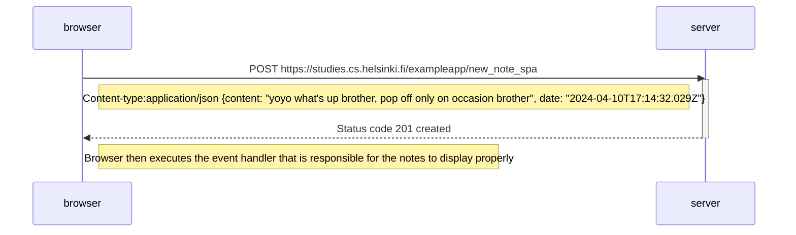

## Exercise 0.6 Part 0

```mermaid

sequenceDiagram
    participant browser
    participant server

    browser->>server: POST https://studies.cs.helsinki.fi/exampleapp/new_note_spa
    activate server

    Note right of browser: Content-type:application/json {content: "yoyo what's up brother, pop off only on occasion brother", date: "2024-04-10T17:14:32.029Z"}

    server-->>browser: Status code 201 created
    deactivate server

    Note right of browser: Browser then executes the event handler that is responsible for the notes to display properly


```